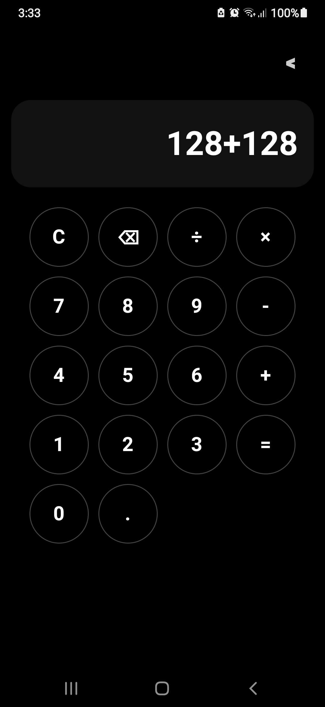
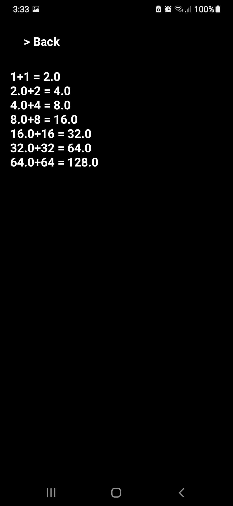

# Eclipse Calculator v2.0 🌙

A dark themed calculator app available for **Windows and Android**.

I originally made Eclipse Calculator as a Python desktop app to learn UI design and application development. Later, I rebuilt it as a native Android app using Kotlin and Jetpack Compose.

This project helped me learn about:
- User interface design
- App development
- Packaging applications
- Building and distributing software

---

## Features

- Basic calculator operations
- Calculation history
- Dark minimalist design
- Rounded calculator buttons
- Custom Eclipse icon
- Long number scrolling
- Mobile-friendly interface
- Standalone applications

---

## Downloads

Note: This release includes both Windows and Android versions. Download the one you need.

### Windows

Go to the **Releases** section and download:

**Eclipse Calculator.exe**

No Python installation required.

Note: Windows may show a warning because the app is unsigned.

---

### Android

Go to the **Releases** section and download:

**EclipseCalculator APK**

Install the `.apk` file on your Android device.

If Android blocks installation:

```
Settings → Security → Install unknown apps → Allow
```

---

## Screenshots

### Windows


### Android




---

## How to Use

### Windows

1. Download the `.exe`
2. Open it
3. Start calculating

### Android

1. Download the `.apk`
2. Install it
3. Open Eclipse Calculator

---

## Built With

### Windows Version
- Python
- CustomTkinter

### Android Version
- Kotlin
- Jetpack Compose
- Android Studio

### Development
- ChatGPT

---

## Credits

Created by 00_Wynn
