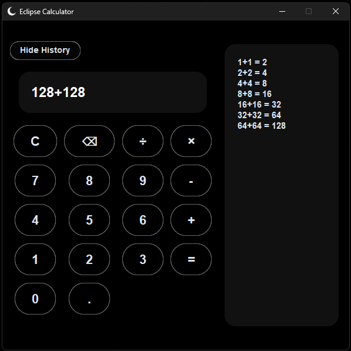

# Eclipse Calculator 🌙

A dark themed calculator app for Windows.
I made this for fun and to learn how to create desktop applications with Python. This project helped me learn about user interfaces, app design, and turning a Python program into a standalone Windows application.

Note: Windows may show a warning since the app is unsigned.

## Download

Go to the **Releases** section and download:

**Eclipse Calculator.exe**

No Python installation required.

## Features

- Basic calculator operations
- Calculation history
- Dark minimalist design
- Rounded buttons
- Custom Eclipse icon
- Standalone Windows application

## How to Use

1. Download the `.exe`
2. Open it
3. Start calculating

## Screenshots

## Built With

- Python
- CustomTkinter
- ChatGPT

## Credits

Created by 00_Wynn
